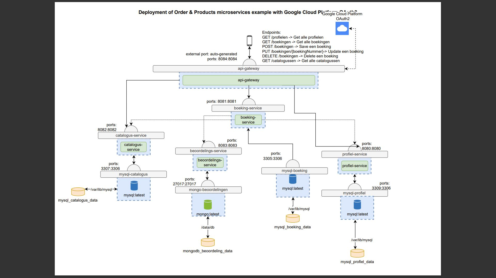
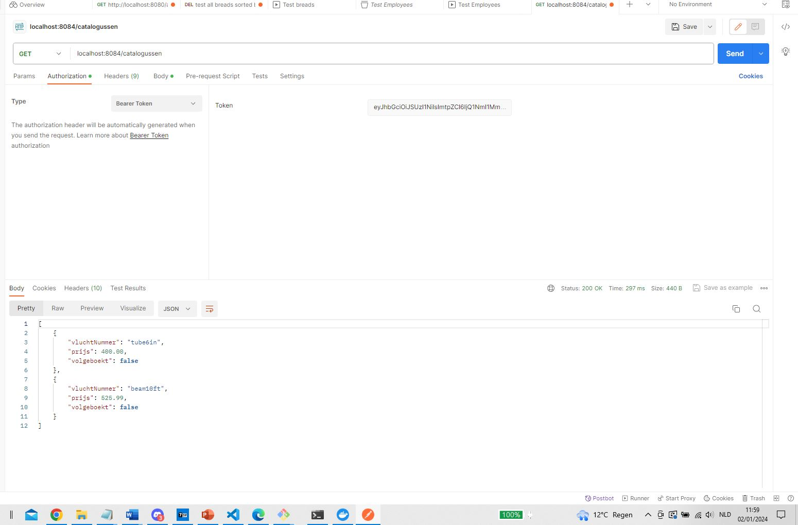
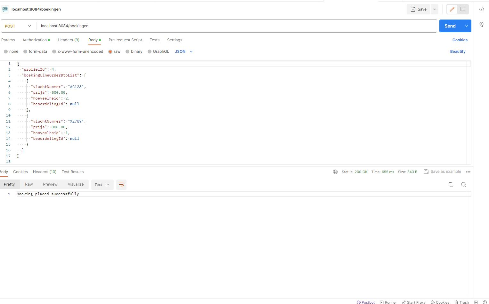
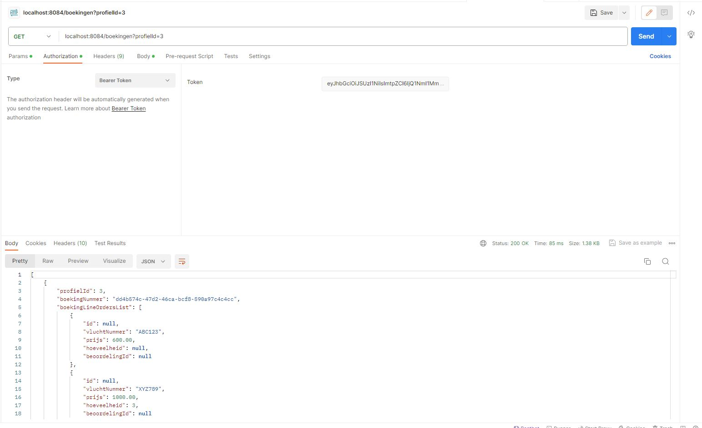
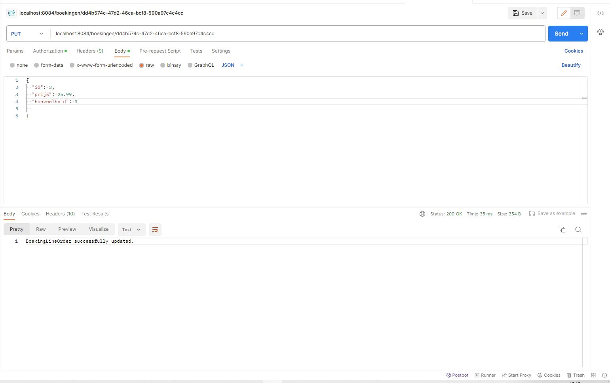
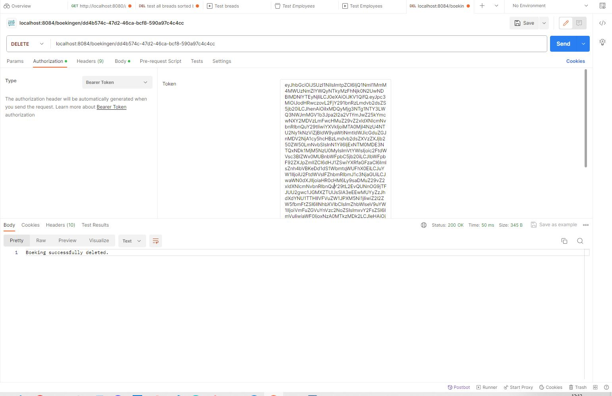
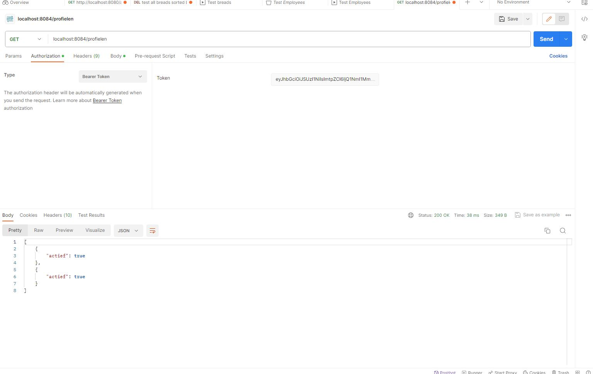
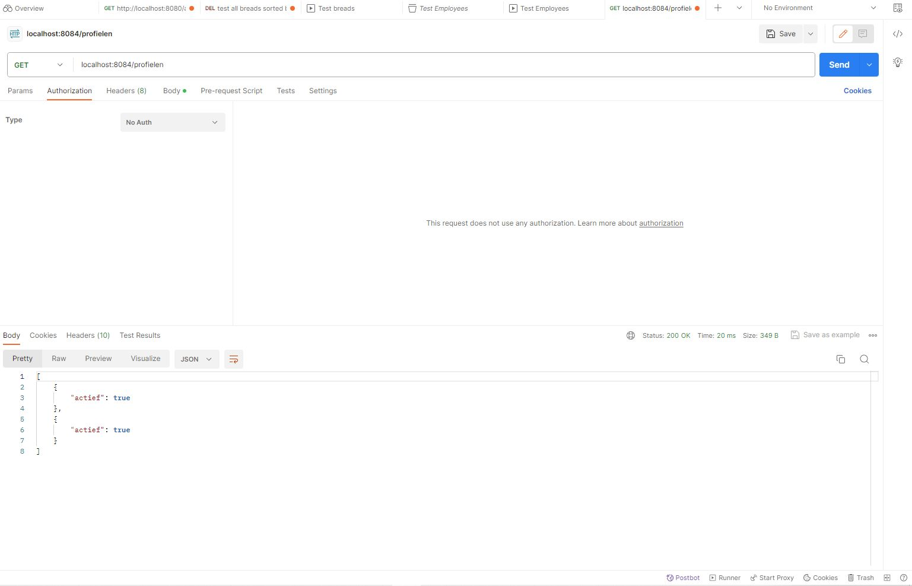
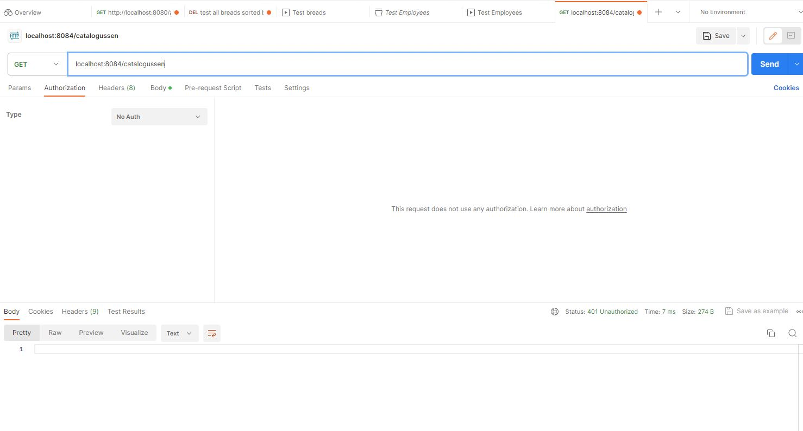

# Microservices-project
# Gekozen thema

Het thema waarvoor wij hebben gekozen, is het opzetten van een geavanceerd reisboekingssysteem. In de moderne wereld van reizen is het belangrijk om flexibele, betrouwbare boekingssystemen te hebben. Ons doel is om een systeem te creëren dat gebruikers in staat stelt reizen te plannen, boeken en beheren.

# Services
## Catalogus service
De eerste service is de catalogus service, in deze service kan men een overzicht van vluchten waarnemen waar men dan kan dan zien of deze al dan niet volgeboekt zijn.
## Boeking service
Wanneer men een vlucht uit de catalogus gevonden heeft kan men deze boeken. Dit zal via onze boeking service gebeuren. Bij het boeken van een vlucht zal er een boekingnummer gegenereerd worden. Als gebruiker is het mogelijk om je boekingen te bekijken, aan te passen en eventueel te verwijderen.
## Profiel service
Je moet natuurlijk eerst een account aanmaken om een boeking te kunnen verrichten, deze worden bijgehouden in de profiel service.
## Beoordelings service
We hebben het ook mogelijk gemaakt om als gebruiker een beoordeling over een bepaalde vlucht te geven zodat andere mensen deze kunnen bekijken en hun keuzes hier op kunnen baseren.

# Componenten

Binnen het project maken we gebruik van volgende componenten:
  - Docker/docker-compose voor het containerizen van onze microservices
  - MySQL/MongoDB voor het opslaan van onze data
  - Java, Maven voor het bouwen en testen van onze services
  - Api-gateway voor het beheren van toegang tot en de samenwerking tussen onze microservices
  - Github Actions voor het opstellen van de CI/CD pijplijn die onze docker images zal builden

# Aantoonbare werking van alle endpoints binnen onze applicatie:
## Met authorisatie:

## Zonder authorisatie

